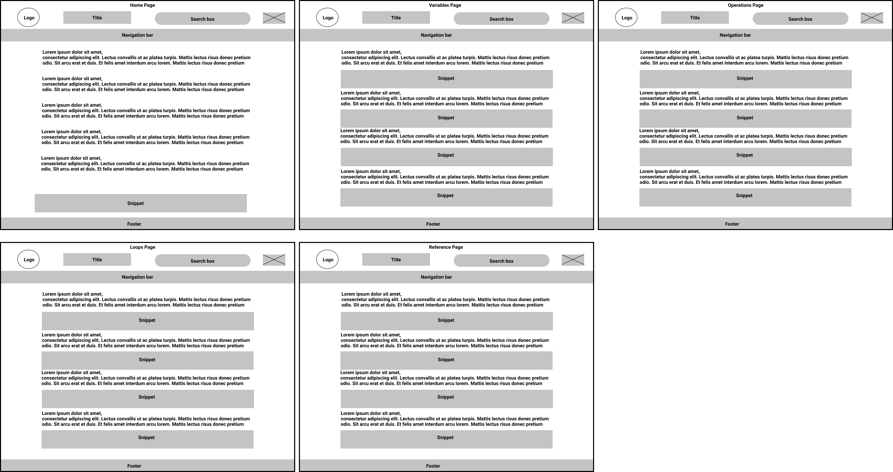

# JavaScript Tutorial guide 

### write a short description of your project:

*JavaScript tutorial guide , including a very detailed explanation , examples and exercises.* 

### who would want to use it? 

*Anyone who is eager to learn JavaScript*

### why would they want to use it?

*To search for information and learn JavaScript as it is one of the most popular programminf language*

### WIREFRAME

---

### 0.Setup 

_As a user_ : _I will see the repository `js-study-guide`  with full readme and the strategy plan_

### REPO

- Fork the repo `js-study-guide` 
- Add collaborators 
- Turn on GitHub pages 
- Create a project board `js-study-guide-project-board`
- Write the strategy plan 

### 1-Design the website pages

_As a user_ : _I will see the Figma file_

_As a visitor_ : _I will see the website designed in Figma file_

- Create a Figma file `Js-Study-Guide` 
- Share the link with the collaborators.

 
#### Figma file

- Design the header and the footer 
- select the fonts and the background 
- Create 5 copies each for one page 

  
### 2-Home 

_As a user_ : _I will see the the `master` branch with index.html file and home.css_

_As a visitor_ : _I will see the home page of the website guide and get more General information about JavaScript_

### REPO

 _This user story is developed on branch `master`._

- Add code to `index.html` and `home.css` 

### HTML
- Add the title , meta tags , links to `home.css`  
- Add the header including the logo , `h1` , search box anf the E-mail links
- Add the navigation bar 
- Add section  with class , `h3` and `p`
- Add section  with class , `h3` and `p`
- Add section  with class , `h3` and `p`
- Add section  with class , `h3` and `p`
- Add snippet `helloWorld`
- Add `footer`

### CSS
- Import fonts
- Add general style font-family, margin , padding and with to `body`, `img` , and `container`.
- Format `header`
- Format the navigation bar `main-nav`
- Format the search box 
- Format `section` , `h3` and `p`
- Format the snippet 
- Format `footer`
  

- Add the change , commit them and push to GitHub

### 3-Variables 

_As a user_ : _I will see the the `variables` branch with variable.html file and style.css_

_As a visitor_ : _I want to know more information about the variables in Javascript_

- Create a new branch `variables` 
- Create a new html file `variables.html`
- Add code to `variables` and `home.css` 

### HTML
- Add the title , meta tags , links to `home.css`  
- Add the header including the logo , `h1` , search box anf the E-mail links
- Add the navigation bar 
- Add section  with class , `h3` and `p`
- Add section  with class , `h3` and `p`
- Add snippet `example`
- Add section  with class , `h3` and `p`
- Add section  with class , `h3` and `p`
- Add snippet `example`
- Add `footer`

### CSS
- Import fonts
- Add general style font-family, margin , padding and with to `body`, `img` , and `container`.
- Format `header`
- Format the navigation bar `main-nav`
- Format the search box 
- Format `section` , `h3` and `p`
- Format the snippets 
- Format `footer`
  

- Add the change , commit them , push to GitHub and checkout `master`
- merge `variables` branch with `master`

### 4-Operations 

_As a user_ : _I will see the the `operations` branch with operations.html file and style.css_

_As a visitor_ : _I want to know more information about the different operations in Javascript_

- Create a new branch `operations` 
- Create a new html file `operations.html`
- Add code to `operations` and `home.css` 

### HTML
- Add the title , meta tags , links to `home.css`  
- Add the header including the logo , `h1` , search box anf the E-mail links
- Add the navigation bar 
- Add section  with class , `h3` and `p`
- Add section  with class , `h3` and `p`
- Add snippet `example`
- Add section  with class , `h3` and `p`
- Add section  with class , `h3` and `p`
- Add snippet `example`
- Add `footer`

### CSS
- Import fonts
- Add general style font-family, margin , padding and with to `body`, `img` , and `container`.
- Format `header`
- Format the navigation bar `main-nav`
- Format the search box 
- Format `section` , `h3` and `p`
- Format the snippets 
- Format `footer`
  

- Add the change , commit them , push to GitHub and checkout `master`
- merge `operations` branch with `master`
  
### 5-Loops 

_As a user_ : _I will see the the `loops` branch with loops.html file and style.css_

_As a visitor_ : _I want to know more information about the different loops in Javascript_

- Create a new branch `loops`
- Create a new html file `loops.html`
- Add code to `loops` and `home.css` 

### HTML
- Add the title , meta tags , links to `home.css`  
- Add the header including the logo , `h1` , search box anf the E-mail links
- Add the navigation bar 
- Add section  with class , `h3` and `p`
- Add section  with class , `h3` and `p`
- Add snippet `example`
- Add section  with class , `h3` and `p`
- Add section  with class , `h3` and `p`
- Add snippet `example`
- Add `footer`

### CSS
- Import fonts
- Add general style font-family, margin , padding and with to `body`, `img` , and `container`.
- Format `header`
- Format the navigation bar `main-nav`
- Format the search box 
- Format `section` , `h3` and `p`
- Format the snippets 
- Format `footer`
  

- Add the change , commit them , push to GitHub and checkout `master`
- merge `loops` branch with `master`

### 6-Reference type (Samir)

_As a user_ : _I will see the the `reference` branch with reference.html file and style.css_

_As a visitor_ : _I want to know more information about the reference type in Javascript_

- Create a new branch `reference`
- Create a new html file `reference.html`
- Add code to `reference` and `home.css` 

### HTML
- Add the title , meta tags , links to `home.css`  
- Add the header including the logo , `h1` , search box anf the E-mail links
- Add the navigation bar 
- Add section  with class , `h3` and `p`
- Add section  with class , `h3` and `p`
- Add snippet `example`
- Add section  with class , `h3` and `p`
- Add section  with class , `h3` and `p`
- Add snippet `example`
- Add `footer`

### CSS
- Import fonts
- Add general style font-family, margin , padding and with to `body`, `img` , and `container`.
- Format `header`
- Format the navigation bar `main-nav`
- Format the search box 
- Format `section` , `h3` and `p`
- Format the snippets 
- Format `footer`
  

- Add the change , commit them , push to GitHub and checkout `master`
- merge `reference` branch with `master`

### 7-Final touches  (Group)

- Make sure everything working properly 
- Correct the errors in html and css files 
- Write full README file
